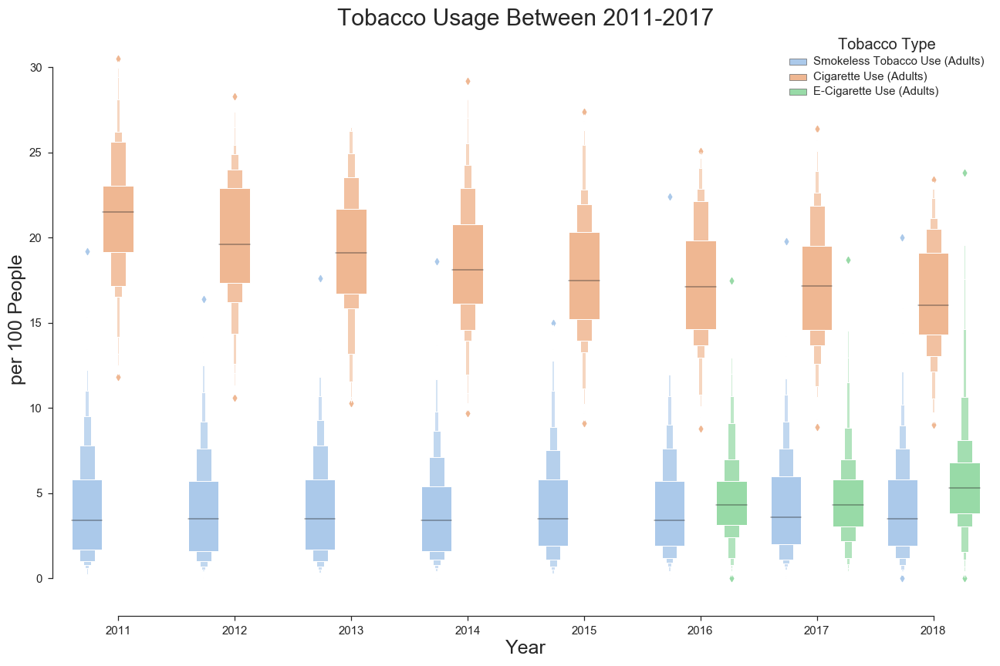
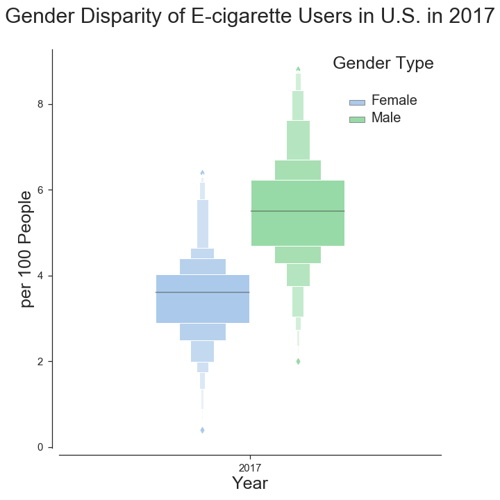
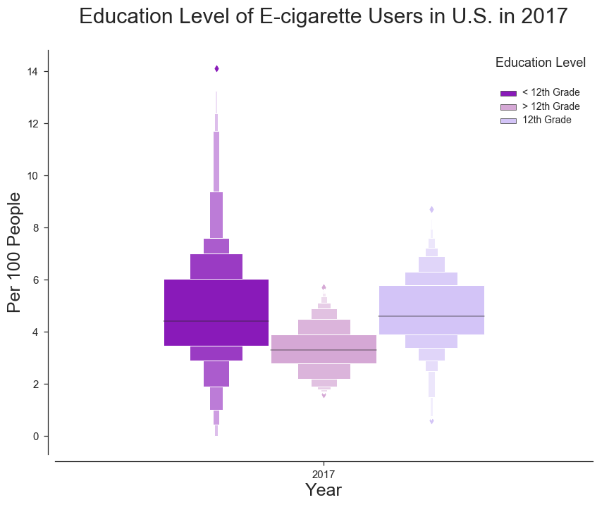

<h2> Behavioral Risk Factor Surveillance System Survey</h2>
  

<h3> A Research on E-cigarette Users of District of Columbia in 2017  </h3>
  

<h4>Yashar Mansouri</h4>

# Φ. Introduction

notebook can be viewed on nbviewer: ``

## Data Description & Resources

**Data Last Updated**: December 11, 2018

**Metadata Last Updated**: February 14, 2019

**Date Created**: June 3, 2014

**Data Provided by**: Centers for Disease Control and Prevention, National Center for Chronic Disease Prevention and Health Promotion, Office on Smoking and Health

**Publisher**: Centers for Disease Control and Prevention

**Contact Name**: OSHData Support

**Contact Email**: OSHData@cdc.gov

**Bureau Code**: 009:20

**Program Code**: 009:020

**Public Access Level**: Public Domain

**Data Dictionary**: https://chronicdata.cdc.gov/Survey-Data/Behavioral-Risk-Factor-Data-Tobacco-Use-2011-to-pr/wsas-xwh5

**References**: https://chronicdata.cdc.gov/d/5amh-5sx3

**Glossary/Methodology**: https://chronicdata.cdc.gov/d/5amh-5sx3

**Category**: Survey Data

**Tags**: osh, office on smoking and health, state system, tobacco, survey, behavioral, risk, surveillance, tobacco use, cigarette, cigarette use, adult, smoking, smoking status, smoker, current, former, never, ever, frequency, every day, some days, demographics, age, gender, race, ethnicity, education, cessation, quit, prevalence, brfss

**License**: Public Domain

**Source Link**: http://www.cdc.gov/brfss/

## A Quick Brief on Data

### Source
Behavioral Risk Factor Surveillance System Survey Data

### Methods
The BRFSS is a continuous, state-based surveillance system that collects information about modifiable risk factors for chronic diseases and other leading causes of death. The data for the STATE System were extracted from the annual BRFSS surveys from participating states. For estimates among racial and ethnic subgroups, two-year combined data are available. Sample sizes of less than 50 were considered to be inadequate for data analysis. The STATE System does not display percentages for these sample sizes; instead, "NA" will appear in the percentage box for that demographic group.

### Sampling

For 2011 data and forward, a random digit dialing system was used to select samples of adults in households with landline or cellular telephones. The sample represented adults from each state who were civilian, aged 18 years or older and not institutionalized. Most states now use a computer-assisted telephone interviewing software program (CATI). This allows the interviewer to enter the data directly into a computer, thus reducing errors and eliminating unacceptable responses. More detailed information on the sampling methodology is located on the BRFSS website (http://www.cdc.gov/brfss/).

### Questionnaire

The questionnaire was composed of three sets of questions: 

1. A core set of questions asked in all participating states. 
2. A standard module containing questions on selected topics developed by CDC and asked at the discretion of each state. 
3. Questions developed for a particular state to meet a particular need.

The core questions allow data to be compared between states. Because many of the same questions are asked each year, emerging health trends can be identified and monitored.

**Notes**: "NA" indicates that survey data are not available. 

**Citation**: Centers for Disease Control and Prevention (CDC). Behavioral Risk Factor Surveillance System Survey Data. Atlanta, Georgia: U.S. Department of Health and Human Services, Centers for Disease Control and Prevention, 2019. 

## Research Purpose & Abstract

### Purpose: 

Vaping and e-cigarette products first appeared in U.S. more than a decade ago and have grown in popularity ever since. There's little research on their long-term effects and after becoming a trend in recent years there are warning signs of an epidemic in the U.S. There is currently more than 800 vaping companies and there's little to none research on the affected users of their products.

Purpose of this research is to provide meaningful analysis on the current usage trends of the e-cigarettes which has been a hot topic in the recent years. In exploratory data analysis, research tries to visualize the usage trend of the current smokers in the United States based on their age, gender, and education difference and further looks whether these differences are significant or not. 

# I. Exploratory Data Analysis (EDA)

## Importing Data via Socrata API

Documentation can be found here: https://dev.socrata.com/foundry/chronicdata.cdc.gov/wsas-xwh5

- Since the data is less than the limit of the API, there' sno need for user and password tokens.
- There is a total of 33451 rows in the dataset. limit is on 35000 to capture all values. 

## Data Cleaning

### Dropping columns

1. **'topictype'** is Tobacco Use - Survey Data on all entries
2. **'topictypeid** is BEH on all entries
2. **'topicid', 'measureid', 'stratificationid1', 'stratificationid2', 'stratificationid3','stratificationid4', 'submeasureid', 'displayorder'** are not needed since theyre used on CDC's application.
3. **':@computed_region_bxsw_vy29', ':@computed_region_he4y_prf8'** created while importing via API and unnecessary
4. **'data_value_footnote', 'data_value_footnote_symbol'** unnecessary since null data_values are dropped based on these twp column
5. **'datasource'** is BRFSS on all entries
6. **'data_value_type'** is Percentage on all entries
7. **'data_value_unit'** is % on all entries

### Dropping NA values

- null values are dropped based on subsetting by **data_value** and **sample_size**

- null response values are kept due to including more than two-thirds of the data.

### Duplicate Values

- Data doesn't show any duplicate values after dropping the nulls subsetted on the **data_value** and **sample_size**

### Dropping Rows

- consecutive 2 year values from rows are taken out."2011-2012", "2012-2013", "2013-2014", "2014-2015", "2015-2016", "2016-2017"

### Setting Type Values

- 'year' value was set to **int**

- 'sample_size', 'data_value', 'data_value_std_err', 'low_confidence_limit', 'high_confidence_limit' were set to **float**

### New Columns

- a **['count']** column was created by multiplying data_value * sample_size, used as the successful rate in samples. 

## EDA Visualizations

- Data analysis is done via pandas_profiling after cleaning

### Dataset info

**Number of variables:**    17

**Number of observations:** 28598

**Missing cells:**  17603 (3.6%)

**Duplicate rows:** 0 (0.0%)

**Total size in memory:**   3.7 MiB

**Average record size in memory:**  136.0 B

### Variables types

**Numeric:**    6

**Categorical:**    9

**Boolean:**    0

**Date:**   0

**URL:**    0

**Text (Unique):**  0

**Rejected:**   2

**Unsupported:**    0

### EDA Visualization 1: 
Analysis of the genders and the data_value per each year from 2011 to 2017

Based on the analysis:  

  

**1**. Cigarette Users have the highest proportion of the U.S. population, however a decreasing pattern is visible between 2011-2017.

**2**. Smokeless tobacco users have the lowest proportion of the society. Smokeless tobacco use means using chewing tobacco or snuff on 1 or more of the 30 days before participation in a survey about this topic.

**3**. According to the dataset e-cigarette reports are have only started from 2016. There are reports saying the e-cigs have been in use from the 80s, yet the modernization began from 2000s.

BRFSS questionnaires started including the e-cigs topic from 2016. Before this, notes were to exclude the e-cigs or vaping from the smoking categories.

[BRFSS 2015 Questionnaire](https://www.cdc.gov/brfss/questionnaires/pdf-ques/2015-brfss-questionnaire-12-29-14.pdf)

### EDA Visualization 2  

  

Looking for the disparity between the gender of e-cig users in 2017 in U.S.

Second visualization shows the median of the male e-cig users seems to be higher than in females in 2017 between all states.

### EDA Visualizations 3
  
Looking for the disparity of education in e-cig users in 2017 in U.S.

Comparing the groups of higher than 12 years of education and lower, shows a median difference of approximately 1 person in 100 in 2017 U.S. population.

### EDA Visualization 4

Visualizing the age disparity of the E-cig users in U.S. in 2017

### EDA Visualization 5

Looking for the states with the highest and lowest percentage of e-cig users in U.S in 2017

According to the report of [U.S News on Sep 30 2019](https://www.usnews.com/news/healthiest-communities/slideshows/which-states-vape-use-e-cigarettes-the-most?slide=12), the rankings are still the same:
    
1. Oklahoma
2. Kentucky
3. Indiana
4. Tennessee
5. Wyoming
6. West Virginia
7. Arkansas
8. Nevada
9. (tie) Colorado
9. (tie) Ohio

### Hypotheses Subsets

# II. Hypotheses Tests

Subsets of dataframe are created according to the hypotheses.

### Tests

Since the values are proportions between two samples, the z-score for proportion comparison is used.

$$
\begin{array}{c}{\mathrm(1-\alpha) 100 \% \text { confidence interval for }} \\ {p_{1}-p_{2} \text { is given by: }} \\\\ {\hat{p}_{1}-\hat{p}_{2} \pm z_{\alpha / 2} \times S E\left(\hat{p}_{1}-\hat{p}_{2}\right)}\end{array}\\\\
$$

$$
\begin{aligned} Z &=\frac{(\hat{p_{A}}-\hat{p_{B}})-\left(p_{A}-p_{B}\right)}{S E\left(p_{A}-p_{B}\right)} =\frac{(\hat{p_{A}}-\hat{p_{B}})-0}{\sqrt{\hat{p}(1-\hat{p})\left(\frac{1}{n_{A}}+\frac{1}{n_{B}}\right)}} \end{aligned}\\
$$

$$
\begin{array}{l}{\text { The sampling distribution of } \hat{p}_{1}-\hat{p}_{2}:} \\\\ {\text { 1- has a mean of } p_{1}-p_{2}} \\ {\text { 2- has a standard deviation of }} \\ {\qquad \sigma_{\hat{p}_{1}-\hat{p}_{2}}=\sqrt{\frac{p_{1}\left(1-p_{1}\right)}{n_{1}}+\frac{p_{2}\left(1-p_{2}\right)}{n_{2}}}} \\ {\text { 3- is approximately normal if the sample }} \\ {\text { sizes are large. }}\end{array}
$$

### Assumptions

$$
\begin{array}{l}{\text { The assumptions of the two sample }} \\ {\text { inference procedures on proportions: }} \\\\ {\text { * We have independent simple random }} \\ {\text { samples from the populations of }} \\ {\text { interest. }} \\\\ {\text { * The sample sizes are large enough for }} \\ {\text { the normal approximation to be }} \\ {\text { reasonable. }}\end{array}
$$

$$
\begin{array}{l}{H_{a}: p_{1}<p_{2}} \\ {H_{a}: p_{1}>p_{2}} \\ {H_{a}: p_{1} \neq p_{2} \leftarrow \text { Two-sided alternative }}\end{array}
$$

#### Hypothesis I Test

Is there a significant difference between the gender and the the proportion of e-cig users in 2017 in DC?

H0: Proportion of males and females are equal

H1: Proportion of males are higher than females

$$
\begin{array}{l}{H_{0}: P_{m}=P_{f}} \\ {H_{1}: P_{m} \neq P_{f}}\end{array}
$$

#### Hypothesis II Test

Q:  Is there a significant difference between the age groups of 25-44 and 44-65 with the proportion of e-cig users in 2017 in DC?

H0: Proportion of the two age groups are equal

H2: Proportions are different

$$
\begin{array}{l}{H_{0}: P_{y}=P_{o}} \\ {H_{2}: P_{y} \neq P_{o}}\end{array}
$$

#### Hypothesis III Test

Q:  Is there a significant difference between proportion of e-cig users and their education level in 2017 in DC?

H0: Proportion of the two education levels are equal

H3: Proportions are different

$$
\begin{array}{l}{H_{0}: P_{h}=P_{L}} \\ {H_{3}: P_{h} \neq P_{L}}\end{array}
$$

# III. Results

There are significant disparities in all three categories of gender, age and education.

In DC in 2017 population, out of every 100 people
- **I**. 3 males and 1.7 females have been e-cig users  
- **II**. 5.8    (18-24 years old) and    2.1    (25-44 years old) have been e-cig users    
- **III**.  1.6  (higher than 12 year educated) and 3  (less than 12 year educated) were e –cig users

